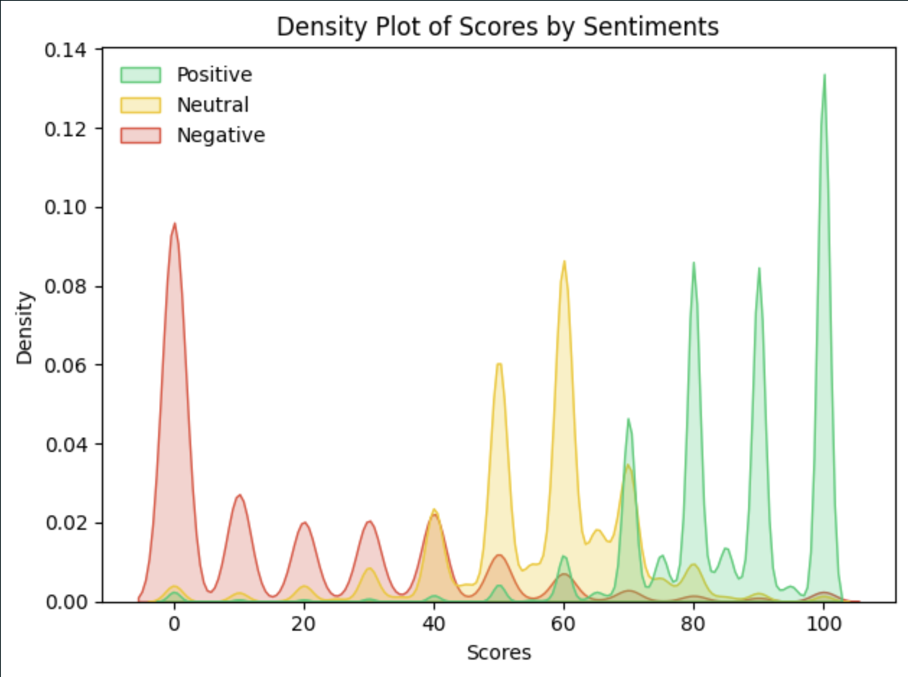

# 🧠 Metacritic Games Sentiment Analysis

**Unlock the emotional pulse of gaming with this sentiment analysis project that deciphers user reviews from Metacritic into powerful insights and visual stories.**

[](https://opensource.org/licenses/MIT)
[](https://www.python.org/)
[](https://huggingface.co/)
[](https://jupyter.org/)


---


## 📊 Project Overview

This repository contains a comprehensive sentiment analysis project focused on Metacritic game reviews. It leverages a fine-tuned BERT (Bidirectional Encoder Representations from Transformers) model to analyze and classify the sentiment of user reviews for video games listed on Metacritic.

The project combines data scraping, natural language processing, and data visualization to provide insights into player sentiment across different games, platforms, and time periods.

## 🎯 Key Features

- **Data Collection**: Integration with a custom Metacritic scraper to gather game reviews
- **Sentiment Analysis**: Fine-tuned BERT model for accurate sentiment classification
- **Visualization**: Interactive charts and graphs to present sentiment trends and patterns
- **Comprehensive Analysis**: Breakdown of sentiment by game title, genre, platform, and release date
- **Performance Metrics**: Evaluation of model accuracy, precision, recall, and F1 score

## 📊 Dataset

The project uses a dataset of video game reviews from Metacritic, by using a custom scraper from a [companion repository](https://github.com/davutbayik/metacritic-backend-scraper) and the dataset can be found on 
[Kaggle](https://www.kaggle.com/datasets/davutb/metacritic-games). The dataset includes:

- User reviews for thousands of video games (over 1.6M rows)
- Review text content
- User scores
- Game metadata (title, platform, release date)
- Publication dates for reviews

## 🤖 BERT Fine-tuning Process

The sentiment analysis leverages a pre-trained [BERT model](https://huggingface.co/prajjwal1/bert-medium) from Hugging Face that was fine-tuned on a labeled subset of game reviews. The fine-tuning process involved:

1. **Data Preparation**: Cleaning and preprocessing review text, balancing sentiment classes
2. **Model Selection**: Using the `bert-medium` model as the foundation
3. **Fine-tuning**: Training the model with review text and sentiment labels
4. **Evaluation**: Testing model performance on a held-out validation set

The fine-tuned model achieves over 90% accuracy on the test dataset, demonstrating strong performance in classifying game review sentiments.

## 🔍 Sentiment Analysis Results

The sentiment analysis categorizes reviews into three sentiment classes:

- **Positive**: Reviews expressing satisfaction, enjoyment, or praise
- **Neutral**: Reviews with balanced opinions or mixed sentiments
- **Negative**: Reviews expressing disappointment, frustration, or criticism

Key insights from the analysis include:

- Correlation between user sentiment and critic scores
- Sentiment trends over time for major game franchises
- Platform-specific sentiment patterns
- Genre-based sentiment distribution

## 📈 Visualizations

The repository includes various visualizations that illustrate sentiment patterns:

- Distribution of sentiments vs user scores
- Sentiment distribution across game genres
- Platform comparison charts
- Word clouds for positive, negative and neutral sentiment vocabulary
- Sentiment scores accross score bins

## 📉 Example Visuals

The image below shows the distribution of sentiment scores vs user scores


The image below shows sentiment score densities over user scores



## 🚀 Getting Started

### Prerequisites

- Python 3.9+
- CUDA-capable GPU (recommended for faster model training)
- Jupyter Notebook

### Installation

1. **Clone the repository**:
   ```bash
   git clone https://github.com/davutbayik/metacritic-games-sentiment-analysis.git
   cd metacritic-games-sentiment-analysis
   ```

2. **Create a virtual environment (Optional - Recommended)**:
   ```bash
   python -m venv .venv
   source .venv/bin/activate  # On Windows: .venv\Scripts\activate
   ```

3. **Install dependencies**:
   ```bash
   pip install -r requirements.txt
   ```

4. **Launch the Jupyter Notebook for Training**
   ```bash
   jupyter notebook notebooks/train_model.ipynb
   ```
   
5. **Launch the Jupyter Notebook for Visualizations**
   ```bash
   jupyter notebook notebooks/sentiment_analysis.ipynb
   ```

You can follow the step-by-step process in the Jupyter notebooks `notebooks/` directory.

## 📓 Notebooks Guide

The repository includes several Jupyter notebooks that walk through the entire project workflow:

1. **train_model.ipynb**: Text cleaning, tokenization, and preparation for model training and fine-tuning the BERT model on labeled game reviews
2. **sentiment_analysis.ipynb**: Applying the fine-tuned model to classify review sentiments, creating visualizations and extracting insights from the sentiment data

## 🧪 Model Performance

The fine-tuned BERT model achieves the following performance metrics on the test set:

| Metric    | Score  |
|-----------|--------|
| Accuracy  | 85.7%  |
| Precision | 85.2%  |
| Recall    | 85.7%  |
| F1 Score  | 85.4%  |

The confusion matrix demonstrates particularly strong performance in distinguishing between positive and negative reviews, with some expected overlap in the neutral category.

## 🔮 Future Work

- Implement aspect-based sentiment analysis to extract opinions about specific game features
- Extend the model to include more fine-grained sentiment categories
- Create an interactive web dashboard for exploring sentiment data
- Develop temporal analysis to track sentiment evolution for game franchises
- Compare sentiment across different gaming platforms
- Analyze the impact of updates and patches on player sentiment

## 📄 License

This project is licensed under the terms of the [MIT License](LICENSE).  
You are free to use, modify, and distribute this software as long as you include the original license.

## 📬 Contact

Made with ❤️ by [Davut Bayık](https://github.com/davutbayik) — feel free to reach out via GitHub for questions, feedback, or collaboration ideas.

---

⭐ If you found this project helpful, consider giving it a star!
